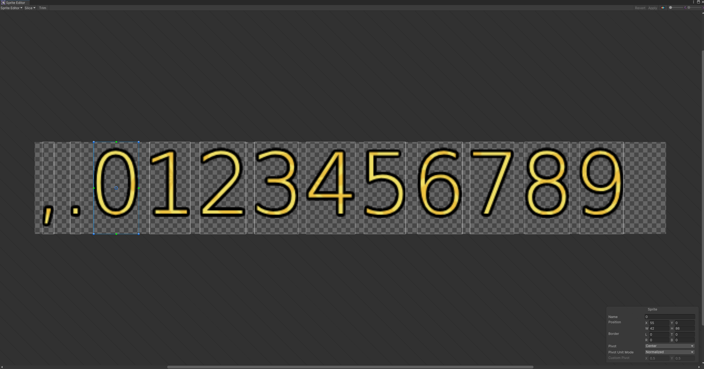

# SpriteTextPro

**SpriteTextPro** 是一個 Unity 套件，用來擴充 [TextMeshPro (TMP)]，將文字自動轉換為 `<sprite>` 標籤，搭配 `TMP_SpriteAsset` 顯示自訂圖像（例如符號、美術字）。適合用於 UI 中需以圖像形式顯示文字內容的應用情境，如 RPG 遊戲中的圖示文字、技能符號。

## 功能特色

- ✅ 使用Unity 內建的 Sprite Editor 進行切圖，並且一鍵產生 `TMP_Sprite Asset`
- ✅ 自動將文字轉換為 TMP `<sprite name="X">` 格式
- ✅ 支援雙向轉換（原始文字 <-> Sprite Tag）

## 安裝方式

1. 確保專案已導入 **TextMeshPro**。
2. 下載 Releases 的 `TMP_SpriteText.zip` 並解壓縮，將 `TMP_SpriteText.unitypackage` 並匯入你的 Unity 專案中。

## 使用方式

### 生成 TMP_Sprite Asset

1. 將圖片的 Sprite Mode 設定為 Multiple ，並且設定字元長寬 (其中Y=0 H=圖片高度)，並設定名稱，詳細設定如下圖

2. 對圖片右鍵選單 `Create > TextMeshPro > Sprite Asset Custom` 或按 `Ctrl+Shift+F11`

### 在場景上生成元件

1. 在 Hierarchy 右鍵選單 > `GameObject > UI > SpriteText - TextMeshPro` 建立元件。
2. 將你自訂的 `TMP_Sprite Asset` 指定給 `SpriteAsset` 欄位。
3. 設定 `text` 屬性，如：

```csharp
    [SerializeField] private TMP_SpriteText spriteText;
    
    void Start()
    {
        spriteText.text = "123,456,789";
        var text = spriteText.text;
        Debug.Log(text);
    }

